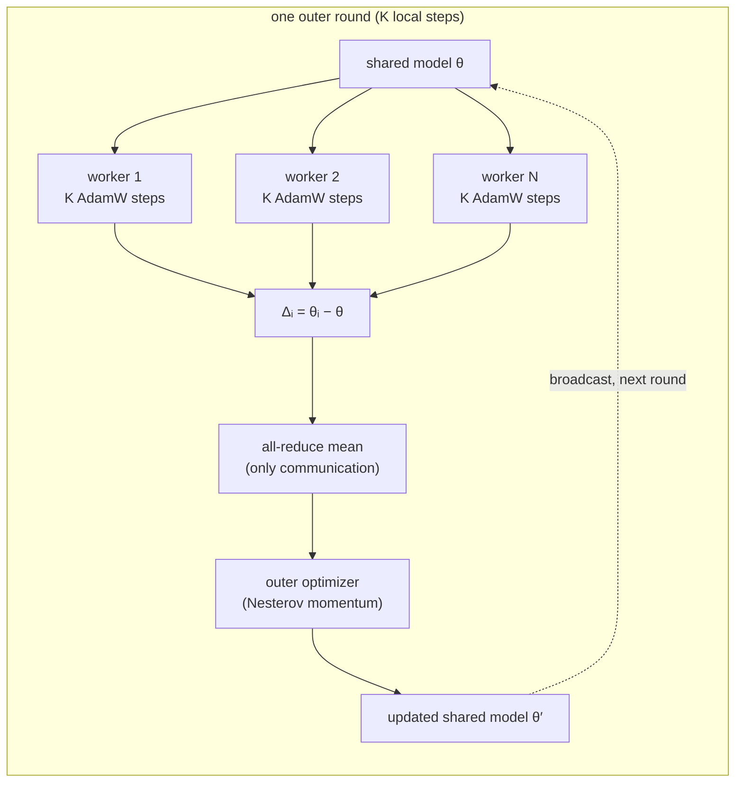
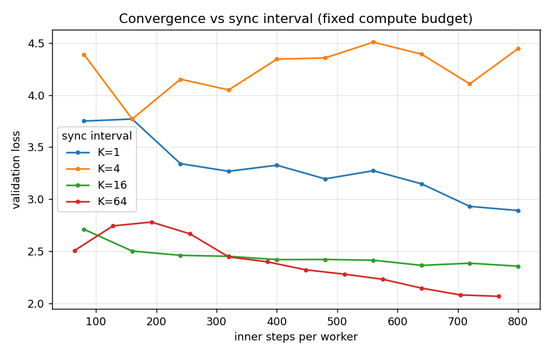
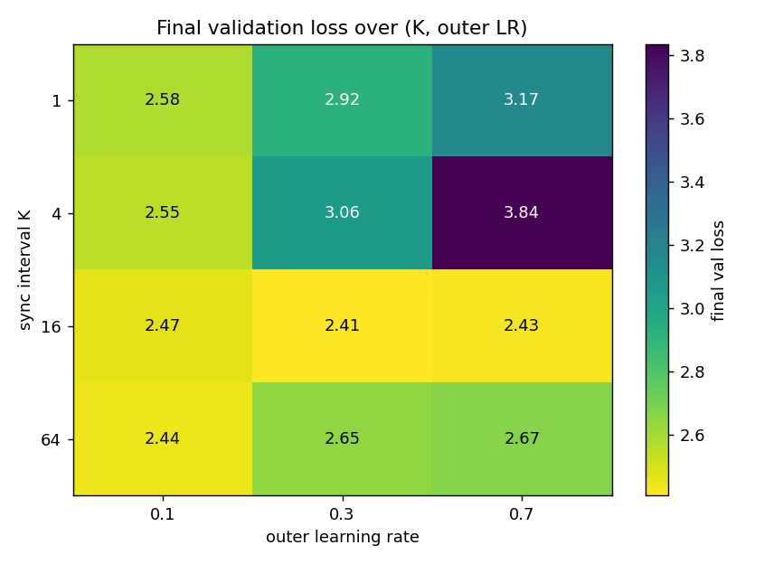
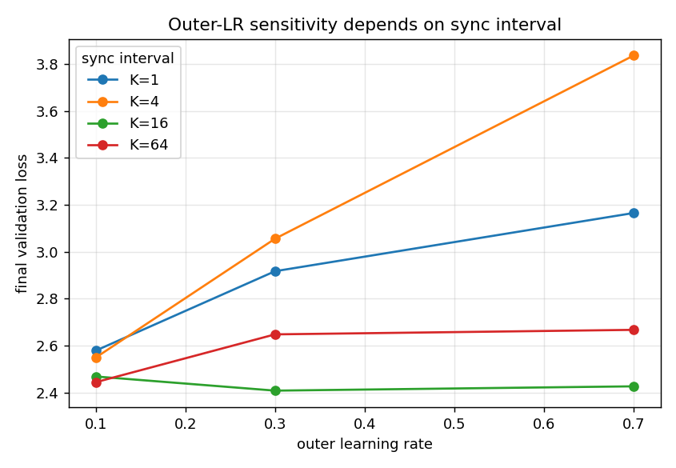
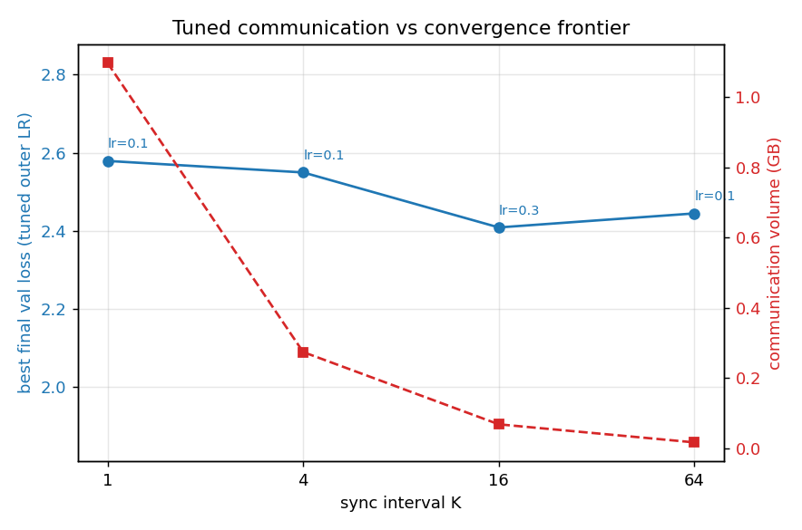

# smol_diloco

**A minimal, research-oriented implementation and exploration of decentralized
optimization for language-model training.**

This repo implements [DiLoCo](https://arxiv.org/abs/2311.08105) (Distributed
Low-Communication training) from scratch on a small character-level transformer,
then uses it to study the question DiLoCo actually exists to answer:

> *How far can you stretch the interval between worker synchronizations before
> convergence degrades — and how much communication does that save?*

The code is small enough to read in one sitting; the point is the experiment, not
the model.

---

## What is DiLoCo?

Standard data-parallel training (DDP) synchronizes gradients **every step**. On a
slow or geographically distributed network that all-reduce dominates wall-clock,
because you pay the full model's bandwidth cost on every single optimizer step.

DiLoCo replaces this with a **two-level (inner/outer) optimization** scheme:

- **Inner loop** — each worker trains independently on its own data shard for `K`
  steps using a standard optimizer (here AdamW). No communication.
- **Outer loop** — every `K` steps the workers average their *parameter deltas*
  (how far each drifted from the shared starting point), and a momentum-based
  **outer optimizer** (Nesterov) applies that averaged delta to the shared model.

Communication happens once per `K` steps instead of once per step, cutting
communication volume by roughly `K×`. The research question is what that costs in
final model quality.



---

## What this repo implements

A faithful, dependency-light DiLoCo in ~300 lines (`smol_diloco.py`):

- **Inner optimizer**: per-worker AdamW with gradient clipping.
- **Outer optimizer**: Nesterov momentum applied to the averaged delta
  (`nesterov_update`), exactly the server-side update from the paper.
- **Real distributed execution**: `torch.distributed` with the `gloo` backend,
  launched via `torchrun`. Deltas are combined with `all_reduce`; the updated
  shared model is `broadcast` back. Single-process runs degrade gracefully to a
  no-op all-reduce.
- **Per-rank data sharding** so workers see disjoint data.
- **Instrumentation**: per-round train/val loss, averaged delta norm, outer-step
  norm, wall-clock, and cumulative communication bytes, written to `metrics.jsonl`.
- A small char-level transformer (`models.py`) trained on Tiny Shakespeare
  (`datasets.py`).

### A deliberate choice: persistent inner optimizer

The paper resets the inner optimizer at every outer step (it uses `K≈500`, so the
reset is amortized). For a sweep that reaches small `K`, resetting AdamW every few
steps would stop it ever accumulating second-moment estimates — an optimizer
artifact that would confound a study of *communication* frequency. So this repo
**persists** the inner optimizer across rounds by default, and exposes
`--reset_inner_opt` to recover the paper's behavior. See the comment in
`smol_diloco.py` for the reasoning.

---

## The experiment

**Setup.** 4 workers (gloo, CPU), one ~429K-parameter char-level transformer
(`n_embd=128, n_head=4, n_layer=2, ctx=128`), Tiny Shakespeare, char vocab of 65.
The **compute budget is held fixed** (same number of inner steps per worker); only
the sync interval `K` varies, so `rounds = budget / K`. Larger `K` ⇒ fewer syncs ⇒
less communication. The question is what that costs in final loss.

Reproduce:

```bash
pip install -r requirements.txt
bash experiments/run_sweep.sh        # naive sweep: K∈{1,4,16,64} @ outer_lr 0.7
python experiments/plot_results.py   # convergence + delta-norm figures
bash experiments/run_grid.sh         # grid: K∈{1,4,16,64} × outer_lr∈{0.1,0.3,0.7}
python experiments/plot_grid.py      # heatmap, sensitivity, tuned frontier + table
```

### What was observed

The interesting result was **not** the textbook frontier — it only appeared after
a failure forced a second experiment.

**1. A fixed outer optimizer silently breaks frequent syncing.** Sweeping `K` with
the outer learning rate held at a paper-typical `0.7`, the *short* sync intervals
trained **worse**, not better. `K=4` never even converged — it oscillated. This is
the opposite of the naive expectation that more communication helps.



**2. Why: the outer LR must scale with the sync interval.** Running the full
`K × outer_lr` grid explains it. At small `K` the per-round delta is tiny but
hundreds of momentum-accumulating outer steps are applied, so a large outer LR
overshoots. At large `K` the deltas are big and few, so the same LR is stable. The
right outer LR therefore *shrinks* as syncs get more frequent — small `K` needs a
small outer LR; large `K` is robust to it.




**3. Tuned, the communication frontier is real.** Taking the best outer LR for each
`K`, all intervals reach essentially the same loss (~2.4–2.58) — so you can push
`K` from 1 to 64, cut communication volume **~64×**, and lose almost nothing. The
DiLoCo premise holds; it just isn't free of hyperparameter retuning.



### Benchmark

Best outer LR per sync interval (fixed compute budget, 4 workers):

<!-- BENCHMARK_TABLE -->
| Sync interval K | Best outer LR | Final val loss | Comm volume (GB) |
|---:|---:|---:|---:|
| 1  | 0.1 | 2.579 | 1.098 |
| 4  | 0.1 | 2.549 | 0.274 |
| 16 | 0.3 | 2.408 | 0.069 |
| 64 | 0.1 | 2.444 | 0.017 |
<!-- /BENCHMARK_TABLE -->

Loss is flat across the column while communication drops ~64×. The full grid (incl.
the unstable `outer_lr=0.7` corner) is in `experiments/grid/`.

---

## Usage

Single process (quick sanity check, MPS or CPU):

```bash
python smol_diloco.py --rounds 50 --local_steps 50 --log_dir runs/solo --sample
```

Multi-worker DiLoCo (4 workers, gloo/CPU):

```bash
TORCH_DEVICE=cpu torchrun --nproc_per_node=4 smol_diloco.py \
  --local_steps 16 --rounds 50 --log_dir runs/diloco_k16
```

Key flags: `--local_steps` (sync interval `K`), `--rounds` (outer rounds),
`--outer_lr` / `--outer_momentum` (server optimizer), `--inner_lr`,
`--reset_inner_opt`, `--val_batches`, `--log_dir`.

---

## Limitations

This is a study tool, not a training framework. In particular:

- **Single machine.** "Workers" are local processes over loopback gloo, so
  communication *volume* is measured but network *latency* — DiLoCo's real-world
  motivation — is not. The frontier shows the bandwidth tradeoff, not wall-clock
  speedup on a slow link.
- **Small scale.** A 429K-param model on Tiny Shakespeare; absolute losses and the
  exact size of the frontier's "knee" will differ at scale. The *shape* of the
  tradeoff is the takeaway.
- **No straggler / fault handling**, no heterogeneous workers, no compression of
  the synchronized deltas (an obvious next lever on top of larger `K`).
- **Data sharding is round-robin** over a single corpus, not truly siloed data
  distributions.

---

## Files

| File | Purpose |
|---|---|
| `smol_diloco.py` | DiLoCo training loop, inner/outer optimizers, distributed plumbing, logging |
| `models.py` | Char-level transformer (and a tiny MLP baseline) |
| `datasets.py` | Tiny Shakespeare + synthetic toy datasets |
| `experiments/run_sweep.sh` | Naive sync-interval sweep (fixed outer LR) |
| `experiments/run_grid.sh` | `K × outer_lr` grid sweep |
| `experiments/plot_results.py` | Convergence + delta-norm figures from a sweep |
| `experiments/plot_grid.py` | Heatmap, sensitivity, tuned frontier + table from the grid |

## References

- Douillard et al., *DiLoCo: Distributed Low-Communication Training of Language
  Models* (2023). https://arxiv.org/abs/2311.08105
